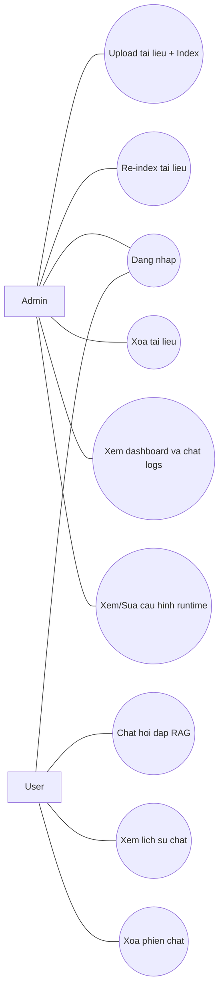
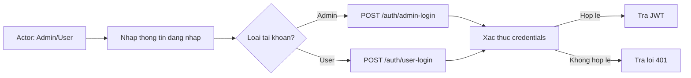
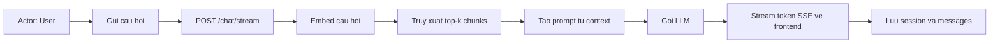
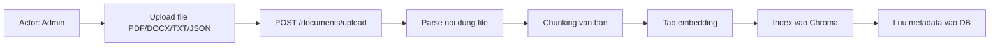
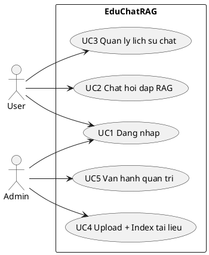
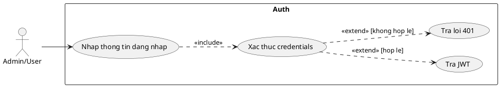
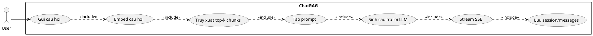
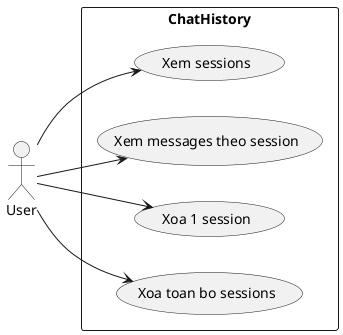
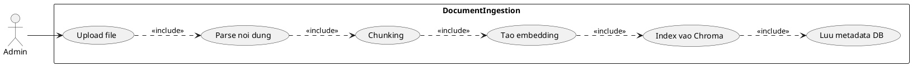
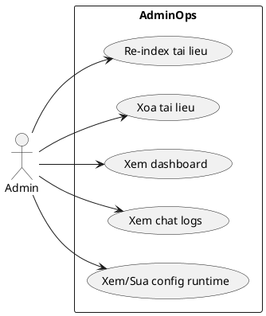

# EduChat RAG - Tro ly giao duc

Ung dung web chat ho tro giao duc su dung FastAPI + React + RAG.

## 1. Kien truc tong quan

- Frontend: React + Vite + TailwindCSS
- Backend: FastAPI + SQLAlchemy + JWT + SSE streaming
- RAG:
  - Embedding: `sentence-transformers/all-MiniLM-L6-v2`
  - Vector store: local JSON + cosine similarity (khong can native build tools)
  - Generator: Groq API (OpenAI-compatible), co fallback demo mode neu chua co API key
- Storage:
  - SQLite cho dev (chat sessions, chat messages, documents)
  - Chroma persistent folder cho vector index

Luong xu ly:
1. Admin upload file PDF/DOCX/TXT/JSON.
2. Backend extract text, chunk theo word window, tao embedding, index vao Chroma.
3. User dat cau hoi tai trang chat.
4. Backend embed cau hoi, truy xuat top-k chunks, tao prompt, stream token tu LLM qua SSE.
5. Lich su hoi dap duoc luu theo chat session.

## 2. Cau truc thu muc

```text
backend/
  app/
    api/            # auth, chat, documents, admin
    core/           # settings + JWT helpers
    db/             # init DB + session
    models/         # SQLAlchemy models
    schemas/        # Pydantic schemas
    services/       # RAG services
    utils/          # chunking
frontend/
  src/
    pages/          # Chat, Upload, Admin
    components/     # UI components
docker-compose.yml
```

## 3. Chay local (khong Docker)

### Backend

```bash
cd backend
python -m venv .venv
# Windows PowerShell
.venv\Scripts\Activate.ps1
pip install -r requirements.txt
copy .env.example .env
uvicorn app.main:app --reload
```

Backend mac dinh chay o: `http://localhost:8000`
Swagger docs: `http://localhost:8000/docs`

### Frontend

```bash
cd frontend
npm install
npm run dev
```

Frontend mac dinh chay o: `http://localhost:5173`

## 4. Chay bang Docker

```bash
docker compose up --build
```

## 5. API chinh

- `POST /auth/admin-login`: Dang nhap admin, tra JWT.
- `POST /auth/user-login`: Dang nhap nguoi dung chat, tra JWT.
- `GET /chat/sessions`: Lay danh sach phien chat.
- `GET /chat/sessions/{id}/messages`: Lay lich su chat theo phien.
- `POST /chat/stream`: Chat streaming SSE (`text/event-stream`).
- `GET /chat/quota?client_id=...`: Xem gioi han cau hoi cho nguoi dung chua login.
- `DELETE /chat/sessions/{id}`: Xoa 1 phien chat.
- `DELETE /chat/sessions`: Xoa toan bo lich su chat.
- `GET /documents`: Danh sach tai lieu.
- `POST /documents/upload`: Upload + index (admin, ho tro PDF/DOCX/TXT/JSON).
- `POST /documents/{id}/reindex`: Re-index tai lieu (admin).
- `DELETE /documents/{id}`: Xoa tai lieu (admin).
- `GET /admin/dashboard`: So lieu tong hop (admin).
- `GET /admin/chat-logs`: Log hoi dap (admin).
- `GET /admin/config`, `PUT /admin/config`: Xem/sua cau hinh runtime (admin).

## 6. Bao mat co ban da co

- JWT cho admin actions.
- Input validation bang Pydantic.
- Gioi han request rate limit middleware (`slowapi`).
- Validate file type upload.
- CORS cau hinh tu env.
- Nguoi dung khong login bi gioi han so cau hoi (`ANONYMOUS_QUESTION_LIMIT`, mac dinh 5).

## 7. Giao dien quan tri backend

- Mo trang `http://localhost:8000/admin/ui`.
- Login bang tai khoan admin de upload/reindex/delete du lieu.
- Frontend (`http://localhost:5173`) chi de chat.

## 7. Bien moi truong quan trong

Xem file `backend/.env.example`:

- `GROQ_API_KEY`: Khoa API Groq.
- `GROQ_MODEL`: Model Groq dung de sinh cau tra loi.
- `RAG_TOP_K`, `RAG_TEMPERATURE`, `RAG_MAX_OUTPUT_TOKENS`: tinh chinh RAG.
- `RAG_CHUNK_SIZE_WORDS`, `RAG_CHUNK_OVERLAP_WORDS`: tinh chinh chunking.

## 8. Ghi chu van hanh

- Neu chua co `GROQ_API_KEY`, he thong van stream du lieu o che do demo.
- He thong se tu dong seed `backend/data/education_knowledge.json` vao index khi startup (neu chua ton tai trong DB).
- Du lieu upload luu trong `backend/uploads`.
- Vector index luu trong `backend/chroma_data`.
- DB SQLite luu trong `backend/app.db`.

## 9. Huong mo rong

- Thay SQLite bang PostgreSQL bang cach doi `DATABASE_URL`.
- Them user system day du (register/login, per-user chat history).
- Them observability (OpenTelemetry, structured logs).
- Tach worker background (Celery/RQ) cho indexing tai lieu lon.

## 10. So do Use Case (chi tiet theo tung ca)

### 10.1 Tong quan actor va ca su dung



### 10.2 UC1 - Dang nhap (Admin/User)



### 10.3 UC2 - Chat hoi dap RAG (streaming)



### 10.4 UC3 - Quan ly lich su chat

```mermaid
flowchart LR
  A[Actor: User] --> B[Xem danh sach phien]
  B --> C[GET /chat/sessions]
  C --> D[Xem tin nhan cua phien]
  D --> E[GET /chat/sessions/{id}/messages]

  A --> F[Xoa 1 phien]
  F --> G[DELETE /chat/sessions/{id}]

  A --> H[Xoa toan bo lich su]
  H --> I[DELETE /chat/sessions]
```

### 10.5 UC4 - Upload tai lieu va cap nhat kho tri thuc



### 10.6 UC5 - Van hanh tri thuc va quan tri he thong

```mermaid
flowchart LR
  A[Actor: Admin] --> B[Re-index tai lieu]
  B --> C[POST /documents/{id}/reindex]

  A --> D[Xoa tai lieu]
  D --> E[DELETE /documents/{id}]

  A --> F[Xem dashboard]
  F --> G[GET /admin/dashboard]

  A --> H[Xem chat logs]
  H --> I[GET /admin/chat-logs]

  A --> J[Xem/Sua cau hinh runtime]
  J --> K[GET/PUT /admin/config]
```

## 11. UML text (PlantUML) cho tung use case

### 11.1 Tong quan Use Case



### 11.2 UC1 - Dang nhap



### 11.3 UC2 - Chat hoi dap RAG



### 11.4 UC3 - Quan ly lich su chat



### 11.5 UC4 - Upload + Index tai lieu



### 11.6 UC5 - Van hanh quan tri


